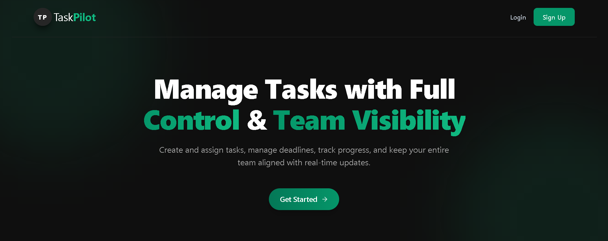

# TaskPilot - Collaborative Task Management Platform

TaskPilot is a full-stack application for team collaboration and task management. Admin can create tasks, assign them to team members, track progress, and communicate through real-time team chat.



## Features

* 🔐 Secure Authentication & Authorization using JWT
* 👥 Role-Based Access Control (Admin, Member, Pending User)
* ✅ Admin Approval Workflow for New User Registration (Pending User → Member)
* 📋 Task Creation, Assignment & Management (Admin Only)
* 👨‍💻 Team Members can View, Update and Complete Assigned Tasks
* 🤖 AI-Powered Task Description Generation using Gemini
* 💬 Realtime Team Chat powered by Socket.IO
* 🔔 Realtime Notifications for Task Assignments and Updates
* 📊 Dashboard with Task Statistics & Weekly Task Activity Analytics
* ⚡ Redis Caching for Faster Task Retrieval
* 👤 User Profile Management
* 📱 Fully Responsive Design for Desktop, Tablet & Mobile
* ⚡ Fast and Modern User Experience

## Tech Stack

### Frontend

* React.js
* Vite
* Tailwind CSS
* Axios
* React Router
* Recharts

### Backend

* Node.js
* Express.js
* MongoDB
* Mongoose
* Redis
* JWT Authentication
* Socket.IO
* Gemini API

### DevOps & Deployment
* Docker
* Docker Compose
* Redis Cloud
* Vercel
* Render

## Project Structure

```text
TaskPilot/
├── client/
│   ├── public/
│   ├── src/
│   ├── Dockerfile
│   ├── package.json
│   └── vite.config.js
│
├── server/
│   ├── config/
│   ├── controllers/
│   ├── middleware/
│   ├── models/
│   ├── routes/
│   ├── services/
│   ├── utils/
│   └── server.js
│
├── docker-compose.yml
├── .gitignore
└── README.md
```

## Installation

### Clone Repository

```bash
git clone https://github.com/Priyanshu12334/taskpilot.git
cd taskpilot
```

### Install Dependencies

Frontend:

```bash
cd client
npm install
```

Backend:

```bash
cd server
npm install
```

## Environment Variables

Create a `.env` file inside the `server` folder and add the required environment variables.

Example:

```env
PORT=5000
MONGO_URI=your_mongodb_connection_string
JWT_SECRET=your_secret_key
REDIS_URL=your_redis_connection_string
GEMINI_API_KEY=your_gemini_api_key
```

## Run Locally

Start Backend:

```bash
cd server
npm start
```

Start Frontend:

```bash
cd client
npm run dev
```

The frontend will be available at the Vite development URL shown in the terminal.

## Run with Docker

Build and start the services:

```bash
docker compose up --build
```

Stop the services:

```bash
docker compose down
```

## Live Demo

* Live Demo: https://taskpilot-ivory.vercel.app


## Default Ports

* Frontend: http://localhost:3000
* Backend: http://localhost:5000

## Author

Priyanshu Suyal

* Linkedin: https://www.linkedin.com/in/priyanshu-suyal-5732b224a
* Portfolio: https://portfolio-ten-blond-87.vercel.app
 